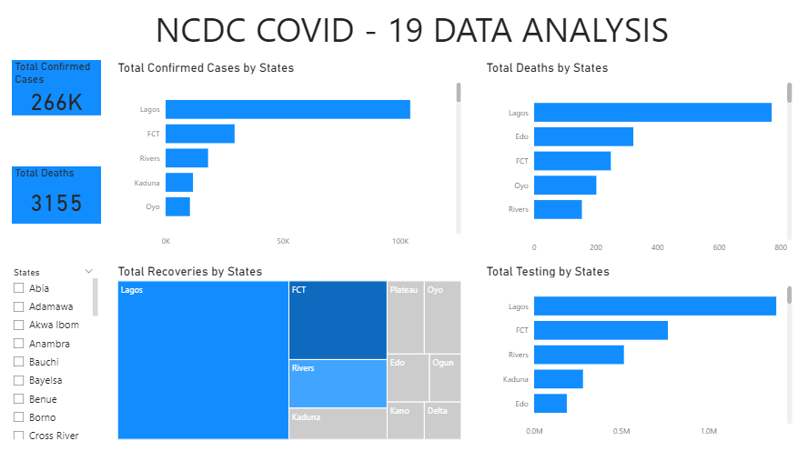

## NCDC COVID-19 DATA ANALYSIS

## Introduction
In the wake of the global pandemic, the National Center for Disease Control (NCDC) has played a pivotal role in monitoring and managing the impact of COVID-19. We will delve into the total confirmed cases, deaths, recoveries, in each state. We're also looking at how much testing has been done. By breaking it down state by state, we aim to uncover patterns and better understand how different areas are coping. Join us in decoding the numbers to get a clearer picture of how COVID-19 is affecting communities across the country.

## Problem Statement
- What is the distribution of total confirmed COVID-19 cases across different states?
- How do the total COVID-19-related deaths vary across different states?
- What is the overall picture of COVID-19 recoveries in each state?
- How does the total COVID-19 testing effort compare among different states?

## Skills
- Statistical Knowledge
- Dashboard Creation.
- Data Cleaning and Preprocessing.
- Data Visualization.
- Domain Knowledge.
- Communication Skills.
- Critical Thinking.
- Problem Solving.

## Data Exploration
- I started by examining the general structure of the dataset. How many rows and columns are there? What are the names of the columns, and what type of information do they contain? 
- I checked for missing values in the dataset. How prevalent are missing values, and do they follow any pattern?
- I compare key metrics (confirmed cases, deaths, recoveries, testing) between different states. Are there notable differences, and what factors might contribute to these variations?

 ## Data Cleaning and Preprocessing
- Identified and assessed missing values in the dataset.
- I checked for and remove any duplicate rows in the dataset.
- Ensured data types are appropriate for each column.
- Checked for inconsistencies in the death rate column, such as different spellings of the same category, and               standardized them.

## Visualization and Analysis
- Lagos state has reported the highest number of confirmed COVID-19 cases, totaling 100,000, followed by the FCT with       30,000, Rivers with 15,000, Kaduna with 7,000, and Oyo with 5,000.
- The distribution of COVID-19-related deaths across various states reveals significant disparities. Lagos stands out       with the highest number of fatalities, totaling 780, indicating a more severe impact in that region. Edo, FCT, Oyo, and   Rivers follow with varying death counts, illustrating the diverse impact of the virus on different states.
- The comprehensive analysis of COVID-19 recoveries in each state reveals that Lagos leads with the highest number of       recoveries, followed by FCT and Rivers.
- The analysis of COVID-19 testing efforts among different states reveals significant variations. Lagos state leads with    the highest testing, totaling 1.5 million, followed by FCT with 750,000, Rivers with 500,000, Kaduna with 300,000, and    Edo state with 200,000.

## Recommendations
- Considering the distribution of confirmed COVID-19 cases across highly affected areas like Lagos, FCT, and Rivers.        it's important to emphasize and enforce the use of face masks, social distancing, and hand hygiene in public spaces.      Also, enhance public awareness through clear and consistent communication about preventive measures and vaccination       benefits.
- In states with higher fatality rates like Lagos, there's an increased urgency to reinforce healthcare infrastructure,     enhance testing, and accelerate vaccination efforts. Additionally, prioritizing targeted interventions in regions with    varying death counts, such as Edo, FCT, Oyo, and Rivers, can help mitigate the impact of the virus.
- Based on the analysis, it's recommended to focus resources on areas with high COVID-19 recovery rates, such as Lagos,     FCT, and Rivers, to maintain and potentially improve these positive outcomes. Additionally, monitoring and implementing   successful strategies from these regions in other states could contribute to overall recovery efforts.
- Given the variations in COVID-19 testing efforts among states, it's recommended to allocate additional resources to       states with lower testing numbers, such as Kaduna and Edo, to enhance their testing capabilities. This can help in        early detection, monitoring, and effective management of the pandemic. Additionally, sharing successful testing           strategies from states with higher testing numbers, like Lagos and FCT, could be beneficial for improving testing         capacities nationwide.
